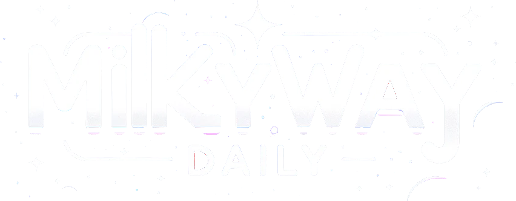

# Milky Way Daily

  
  

<h1 align="center">
  
</h1>

  
  
  
  
  
  

## La Genesi del Progetto

Milky Way Daily è un restyling di un <a href="https://github.com/Vikappa/astroscope" >progetto</a> fatto durante il corso fullstack di <a href="https://epicode.com/it/">Epicode</a>, con l'obiettivo di creare un'esperienza utente visivamente più accattivante prendendomi più tempo di quello a disposizione per la consegna originale. Ho generato sfondo e logo con DALL-E per avere un buon contrasto di sfondo col testo bianco ma anche un bel "panorama" sull'universo, e modificato la mappa colori di bootstrap per avere design e animazioni coerenti con il tema che veniva man mano definendosi. Il design delle facciate è stato progettato per essere responsive e prende di petto qualunque dispositivo, essendo progettato a partire da 280px di larghezza, praticamente funziona su uno smartwatch. I campi sono popolati coi dati ottenuti dall'API <a href="https://epicode.com/it/">SpaceFlight</a> per avere informazioni aggiornate su tutti i principali provider di notizie a tema.

## Migliorie Apportate

- **Risorse Grafiche con DALL-E**: L'uso di immagini generate con AI mi ha permesso di creare risorse grafiche che rispecchino il tema e il colpo d'occhio che volevo apportare.
- **Mappa Colori Personalizzata**: La selezione e l'adattamento dei colori di Bootstrap per abbinarsi alle nuove risorse grafiche hanno creato un'interfaccia molto più interessante.
- **Redux**: Ho migliorato l'implementazione dello store Redux del progetto originale, utilizzando i più moderni modelli di Async Thunk di Redux Toolkit in TypeScript.
- **Design dell'Homepage**: Un restyling completo dell'homepage ha migliorato l'esperienza utente, rendendo la navigazione visivamente accattivante.

## Tecnologie Utilizzate

- **React**: Per la creazione di un'interfaccia utente dinamica e "reattiva" (citazione necessaria).
- **TypeScript**: Sebbene un progetto del genere non avrebbe avuto problemi a funzionare in JavaScript, ho deciso di adottare TypeScript per usare il progetto come palestra per fare il callo con la tipizzazione statica.
- **Redux**: Per una gestione efficace dello stato dell'applicazione, facilitando la comunicazione tra componenti. Sono particolarmente soddisfatto per come ho implementato 4 slice asincrone che fetchano i dati separatamente.
- **Bootstrap**: Per un design responsivo e personalizzato, che si adatta a qualsiasi dispositivo. Qualsiasi. Ti sfido a navigare dal monitor della lavatrice
- **React Router**: Per navigare tra le pagine dell'applicazione senza ricaricare la pagina web (e rompere lo store di Redux).

  
  
  
  
  

